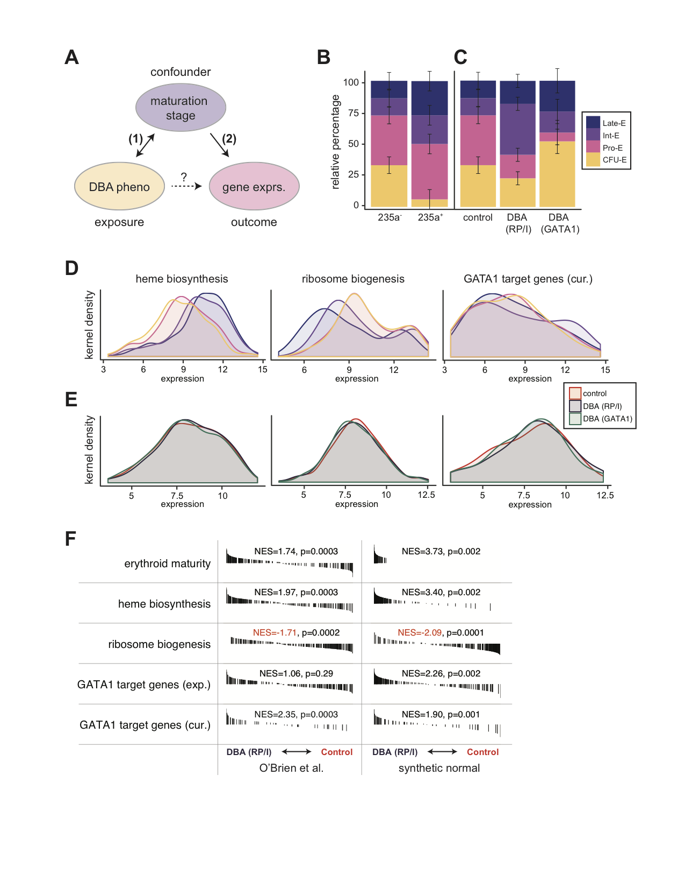

# Confounding in _ex vivo_ models of Diamond Blackfan anemia

This repository contains all data and analyses performed to assess
potential confounding of the transcriptomic _ex vivo_ profiles
examined in [O'Brien _et al._](http://www.bloodjournal.org/content/early/2017/04/03/blood-2017-01-760462?sso-checked=true)
due to variability in cell type composition. Below is a roadmap
to our analysis framework as well as a synthesis of our results. 

## Raw Data

All raw microarray samples (.CEL files) can be found in the [data](https://github.com/julirsch/dba_letter/tree/master/data) subdirectory. For our analyses, 
we reprocessed the data produced in [O'Brien _et al._](http://www.bloodjournal.org/content/early/2017/04/03/blood-2017-01-760462?sso-checked=true),
which is contained under accession [GSE89540](https://github.com/julirsch/dba_letter/tree/master/data/GSE89540_RAW). To develop and evaluate samples
of transcript profiles we turned to the folowing datasets:

- [GSE22552](https://github.com/julirsch/dba_letter/tree/master/data/GSE22552_RAW) from [Merryweather-Clarke _et al._](https://www.ncbi.nlm.nih.gov/pubmed/21270440)
- [GSE24759](https://github.com/julirsch/dba_letter/tree/master/data/GSE24759_RAW) from [Novershtern _et al._](https://www.ncbi.nlm.nih.gov/pubmed/21241896)
- [GSE41817](https://github.com/julirsch/dba_letter/tree/master/data/GSE41817_RAW) from [Ludwig _et al._](https://www.ncbi.nlm.nih.gov/pubmed/24952648)

## Analyses

All analyses were performed in `R`, and all code to reproduce our findings is contained within
the [code](https://github.com/julirsch/dba_letter/tree/master/code) subdirectory. While the
raw `.R` scripts are contained and can be executed
after cloning or downloading this repository, we've rendered summary webpages of our analyses
for ease of understanding the analyses performed. 

#### Data import / preprocessing

To ensure the validity of our findings, we performed all normalization and down stream
analyses using two different flavors of preprocessing. Each mode used primarily 
either RMA through the [oligo package](https://www.bioconductor.org/packages/devel/bioc/manuals/oligo/man/oligo.pdf)
or the [SCAN package](https://www.bioconductor.org/packages/devel/bioc/vignettes/SCAN.UPC/inst/doc/SCAN.vignette.pdf). We performed batch normalization using COMBAT as implemented in the [sva package](https://www.bioconductor.org/packages/devel/bioc/manuals/sva/man/sva.pdf) We also used the [limma](http://bioconductor.org/packages/release/bioc/html/limma.html) package to establish gene signatures for each reference cell type composition from controls.

- RMA normalization [summary webpage](code/RMA_analysis.html) and corresponding [Rscript](https://github.com/julirsch/dba_letter/tree/master/code/RMA_analysis.R)
- SCAN normalization [summary webpage](code/SCAN_analysis.html) and corresponding [Rscript](https://github.com/julirsch/dba_letter/tree/master/code/SCAN_analysis.R)

#### Differential Expression Analyses

Here, we used the [limma](http://bioconductor.org/packages/release/bioc/html/limma.html) package
to investigate key transcripts in each of the RMA and SCAN processed samples for both studies that had investigated differential expression between erythroid cells from DBA and control samples using microarrays.

- Differential expression [summary webpage](code/DE_analysis.html) and [Rscript](https://github.com/julirsch/dba_letter/tree/master/code/DE_analysis.R)

#### CIBERSORT

To estimate the per-sample cell type composition, we classified each sample using a support
vector regression framework as previously implemented in [CIBERSORT](http://www.nature.com/nmeth/journal/v12/n5/abs/nmeth.3337.html).
As CIBERSORT was originally distributed through a [web interface](https://cibersort.stanford.edu/),
we implemented their approach locally in this [Rscript](https://github.com/julirsch/dba_letter/tree/master/code/CIBERSORT.r)
for convenience and reproducibility.

- RMA normalization [summary webpage](code/CIBERSORT_RMA_analysis.R) and corresponding [Rscript](https://github.com/julirsch/dba_letter/tree/master/code/CIBERSORT_RMA_analysis.R)
- SCAN normalization [summary webpage](code/CIBERSORT_SCAN_analysis.html) and corresponding [Rscript](https://github.com/julirsch/dba_letter/tree/master/code/CIBERSORT_SCAN_analysis.R)

#### Gene Set Analyses

For each of the major gene sets discussed in this correspondence, we've created a separate analysis
script to characterize and compare enrichments. We investigated both typical [GSEA](http://www.pnas.org/content/102/43/15545.abstract) results using the [fgsea package](https://bioconductor.org/packages/release/bioc/html/fgsea.html) and looked at the distributions of gene sets more directly. Specific hypothesis tests reported in the paper are also shown. We also create [synthetic normals](http://www.nature.com/ng/journal/v48/n10/full/ng.3646.html) in the [DE analysis code](code/DE_analysis.R) for each sample, which is the linear combination (%) of expression profiles of each control erythroid stage. We run GSEA on these synthetic normals directly and also use them to correct for cell type composition in the control and DBA samples from O'Brien et al.

- Summary webpages for [GATA1 targets](code/GS_GATA1_analysis.html), [heme biosynthesis](code/GS_Heme_analysis.html), [ribosome biogenesis](code/GS_RB_analysis.html), and [multiple genesets using GSEA](code/GS_GSEA_analysis.html)
- Corresponding `.R` scripts for [GATA1 targets](https://github.com/julirsch/dba_letter/tree/master/code/GS_GATA1_analysis.R), [heme biosynthesis](https://github.com/julirsch/dba_letter/tree/master/code/GS_Heme_analysis.html), [ribosome biogenesis](https://github.com/julirsch/dba_letter/tree/master/code/GS_RB_analysis.html), and [multiple genesets using GSEA](https://github.com/julirsch/dba_letter/tree/master/code/GS_GSEA_analysis.html)

## Processed Data

To speed up computational rendering at various stages and to ensure that our analyses were
reproducible, we generated several binary `R` objects contained in `.rds` files that are housed
in the [processed](https://github.com/julirsch/dba_letter/tree/master/processed) subdirectory. These objects can be immediately read into the 
`R` environment using the [readRDS](https://www.rdocumentation.org/packages/base/versions/3.4.0/topics/readRDS) function.
Additionally, four `.txt` files are contained in the [processed](https://github.com/julirsch/dba_letter/tree/master/processed) subdirectory 
that contain the gene signatures for GSE22552 and GSE24759 under both methods of normalization. 

## Overall

In brief, these analyses suggest that the _ex vivo_ samples produced by O'Brien _et al._
did not have identical cell composition, which we show can confound the association
reported in this study. Moreover, our results suggest that the effects uncovered in their
analyses can be attributable to cell type composition. The following figure summarizes our
findings from a re-analysis of their data. 

**Figure 1. Evidence for confounding in microarray analysis of Diamond Blackfan anemia models.**

(A) Diagram of hypothetical relationships between exposure, outcome, and putative confounding
variable in the O’Brien et al. study. (B) Accurate deconvolution of early (CD235a-) and late (CD235a+)
erythroid maturation stages by CIBERSORT in O’Brien et al. samples based upon normal erythroid
maturation from GSE22552 (p = 0.000057 from likelihood ratio test). (C) Although similarly
sorted for CD235a-, DBA samples are comprised of different mixtures of maturation stages
than unaffected control samples. DBA due to RP or indeterminate (RP/I) samples are on average
more mature (p = 0.017 from likelihood ratio test), whereas DBA due to GATA1 samples are
less mature (p = 0.012 from likelihood ratio test). (D) Kernel density plots for heme
biosynthesis, ribosome biogenesis, and curated (cur.) GATA1 target genes. Heme biosynthesis
and ribosome biogenesis are significantly associated with erythroid maturation stage
(p < 10^-10 for both by Kruskal-Wallis), whereas curated GATA1 target genes are only
significant by more sensitive pairwise GSE analysis tests. Ribosome biogenesis was
chosen as a more general measurement of “translational machinery” since snoRNAs were
not measured in all microarrays. (E) Similar to (D), except for the three groups
investigated in O’Brien et al. Differences between genotype (RP/I, GATA1, or unaffected)
are much smaller than between stages (Kruskal-Wallis p > 0.5 for all comparisons, but
significant by pairwise GSE anlaysis). (F) Similar GSE analysis to that reported by
O’Brien et al. is shown. Synthetic stage-matched normal samples were created using the
estimate from (B) of the percentage of each erythroid stage present. GSE analysis
indicates that these synthetic normals have equivalent or stronger GSE results when
compared directly to the original samples. Black bars indicate genes that are ranked
according to expression differences between DBA (RP/I) and unaffected controls and
normalized enrichment scores (NES) are reported. All data presented in this figure was
RMA-normalized (see online analysis for SCAN-normalized). 

## Contact
[Jacob C. Ulirsch](mailto:julirsch@broadinstitute.org)
[Vijay G. Sankaran](mailto:sankaran@broadinstitute.org)
